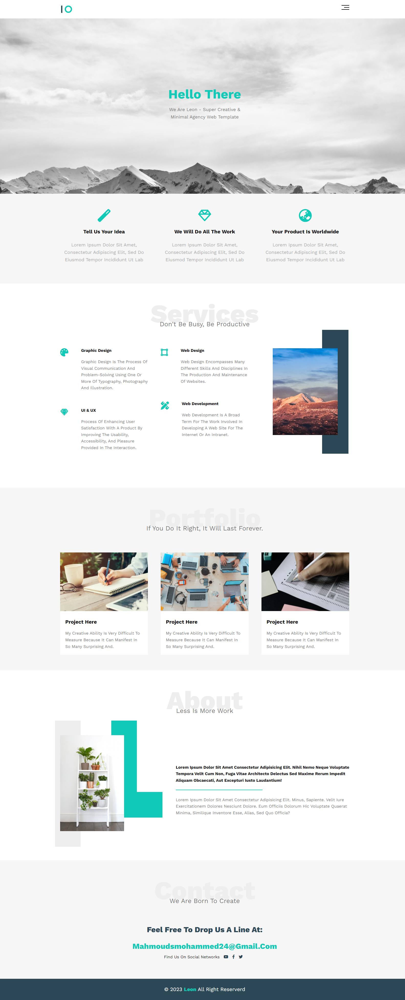

# Leon Landing Page

my first landing page using HTML and CSS

## Table of contents

- [Overview](#overview)
  - [The page features](#the-page-features)
  - [Screenshot](#screenshot)
  - [Links](#links)
- [My process](#my-process)
  - [Built with](#built-with)
  - [What I learned](#what-i-learned)
- [Author](#author)

## Overview

### The page features

Users should be able to:

- View the optimal layout for the interface depending on their device's screen size
- See hover and focus states for all interactive elements on the page

### Screenshot

Desktop view


### Links

- Live Site URL: [Add live site URL here](https://mahmoudsmohammed.github.io/Project_one/)

## My process

### Built with

- HTML5 
- CSS custom properties
- Flexbox
- CSS Grid
- Mobile-first workflow

### What I learned

- How structure the project files
- Using Git and Github 
- Responsive Design and how to use a container
- Use class to creak my own framework
```css
.cont {
  width: fit-content;
  margin: auto;
  text-align: center;
}
```
- Use CSS variables
```css
:root {
  --main-color: #10cab7;
  --secondary-color: #2c4755;
  --section-padding: 60px;
  --section-background: #f6f6f6;
  --main-duration: 0.5s;
  --line-height: 1.6;
  --p-color: #727272;
}
```

## Author

- Linkedin - [Mahmoud Sayed](https://www.linkedin.com/in/mahmoud-sayed-b85536217/)
- Frontend Mentor - [@MahmoudsMohammed](https://www.frontendmentor.io/profile/MahmoudsMohammed)
- Codewars - [@MahmoudsMohammed](https://www.codewars.com/users/MahmoudsMohammed)
